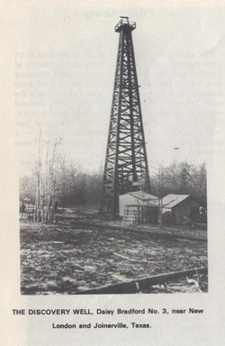

# Wildcatting:

## East Texas, Gusher Age

*The easy-going rural life of East Texas changed drastically with the
discovery of oil in 1930 and 1931 – years of hardship, scorn, luck and wealth which brought people, ideas, institutions and national attention to East Texas.*

## API

    POST    /game/                     - create a game -> gameID
    GET     /game/                     - list games
    GET     /game/<id>/                - game summary
    POST    /game/<id>/                - join -> playerID
    POST    /game/<id>/player/<id>/    - start/survey/drill/sell -> player state
    GET     /game/<id>/player/<id>/    - player state
